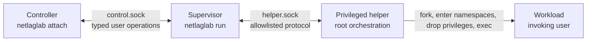

# Architecture decisions by feature

This directory records the accepted architecture of NetLagLab by feature. It
does not replace the source code or claim that the target design is already
implemented.

## Evidence labels

Each feature document separates four kinds of information:

- **Implemented**: behavior present in the current working-tree code. The
  production sources and tests are authoritative; the
  [runtime call map](../runtime_call_map.md) is the detailed guide.
- **Experimentally verified**: behavior demonstrated manually in
  [Experiment 01](../experiment_01.md), but not integrated into NetLagLab.
- **Accepted target design**: a design decision to preserve during future
  implementation. It is not an implementation claim.
- **Open decision**: a question intentionally left unresolved. Implementations
  that depend on it must stop and obtain a decision instead of choosing
  silently.

## Feature map

| Feature | Responsibility | Current state |
|---|---|---|
| [Session lifecycle](session-lifecycle.md) | Session scope, startup, termination, result precedence, and host-wide exclusivity | Partially implemented; target lifecycle accepted |
| [Workload execution](workload-execution.md) | Workload parentage, namespace entry, user identity, execution context, and descendant ownership | Direct supervisor launch implemented; helper-owned launch is target design |
| [Supervisor-helper protocol](supervisor-helper-protocol.md) | Privilege boundary, authentication, framing, start block, commands, acknowledgements, and events | Initial `READY` handshake implemented; full protocol is target design |
| [Controller control plane](controller-control-plane.md) | Attached commands, value grammar, serialization, status, stop, detach, and terminal responses | `help`, `status`, and `detach` implemented; mutation and stop commands are target design |
| [Network environment](network-environment.md) | Network namespace, veth pair, addresses, routing, DNS mount, and readiness | Manually verified only; DNS contents and host route policy remain open |
| [Host networking and firewall](host-networking-and-firewall.md) | Forwarding preflight, NAT, firewall adapters, consent, and host-policy boundaries | Manually verified only; production adapters and recovery are not implemented |
| [Traffic shaping](traffic-shaping.md) | Network Profile semantics, direction mapping, `tc/netem`, live deltas, and rollback | Typed validation implemented; runtime shaping is not implemented |
| [Cleanup and recovery](cleanup-and-recovery.md) | Owned-resource cleanup, partial-failure rollback, descendant semantics, and interrupted persistent changes | User-runtime RAII exists; complete privileged cleanup and recovery are target design |

## System boundary

The accepted target architecture has four cooperating process roles:

- The **Supervisor** owns user-facing Session coordination and Controller
  semantics.
- The **helper** owns privileged setup, the directly managed Workload process,
  privileged mutations, reaping, and cleanup.
- The **Workload** runs with the invoking user's identity and execution
  context, never with root privileges.
- The **Controller** is optional and owns no Session resources. Detaching or
  losing it does not end the Session.

This differs from the current implementation: today the Supervisor directly
starts and reaps the Workload, while the helper only authenticates the
Supervisor, sends `READY`, and waits for a limited shutdown protocol.

## Cross-cutting invariants

- Linux and IPv4 are the MVP platform; one active Session is allowed for the
  whole host.
- User-controlled text is never inserted into a shell command. Executables and
  arguments are passed separately, and the privileged interface is allowlisted.
- Startup and privileged mutation are transactional. A failed rollback or an
  unknown applied state fails the Session with infrastructure result `125`.
- The public Network Profile is only the last state confirmed by the helper;
  there is no separate requested profile.
- NetLagLab removes only resources it created and can prove it owns. It does
  not disable the firewall, change its default policy, or delete unrelated
  host state.
- Session success includes successful cleanup of every NetLagLab-owned
  resource.

## Open decisions

Three decisions are deliberately unresolved:

1. **DNS contents (Q64):** whether to use a read-only resolver snapshot or a
   host-side DNS proxy.
2. **Host route selection (Q65):** whether forwarded Workload traffic follows
   current host routing dynamically or uses an uplink pinned at Session start.
3. **Persistent recovery journal (Q47):** the final path, schema, transaction
   protocol, and reconciliation behavior for persistent firewall changes.

The exact complete helper-protocol state machine and message vocabulary also
remain implementation design work. The semantic ordering and safety contracts
already accepted are recorded in
[Supervisor-helper protocol](supervisor-helper-protocol.md).
