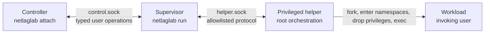

# Architecture decisions by feature

This directory records the accepted architecture of NetLagLab by feature. It
does not replace the source code or claim that the target design is already
implemented.

## Evidence labels

Each feature document separates four kinds of information:

- **Implemented**: behavior present in the current working-tree code. The
  production sources and tests are authoritative; the
  [runtime call map](../runtime_call_map.md) is the detailed guide.
- **Experimentally verified**: observations recorded in
  [Experiment 01](../experiment_01.md). Those experiments are separate from
  the implementation status listed for each feature below.
- **Accepted target design**: a design decision to preserve during future
  implementation. It is not an implementation claim.
- **Open decision**: a question intentionally left unresolved. Implementations
  that depend on it must stop and obtain a decision instead of choosing
  silently.

## Architecture explorations

The following notes preserve architecture-review findings and their current
decision status. They are not implementation plans or authorization to change
code. An unresolved candidate must be explored against the current working tree
and accepted feature documents before its interface is designed.

| Exploration | Status | Main question |
|---|---|---|
| [Deepen the Session lifecycle module](candidate-session-lifecycle.md) | Implemented checkpoint | Can helper, Workload, result, and cleanup ownership become one coherent lifecycle? |
| [Deepen the Supervisor-helper conversation](candidate-supervisor-helper-conversation.md) | Implemented for lifecycle | Can framing and legal ordering become one test surface? |
| [Concentrate Workload execution](candidate-workload-execution.md) | Implemented checkpoint | Can implicit execution-context knowledge become local? |
| [Deepen the Controller control plane](candidate-controller-control-plane.md) | Worth exploring | Can both endpoints share semantic conversation rules without coupling presentation to the Session? |

## Feature map

| Feature | Responsibility | Current state |
|---|---|---|
| [Session lifecycle](session-lifecycle.md) | Session scope, startup, termination, result precedence, and host-wide exclusivity | Helper-owned local network preparation, Workload lifetime, and explicit cleanup implemented; privileged Session qualification remains open |
| [Workload execution](workload-execution.md) | Workload parentage, namespace entry, user identity, execution context, and descendant ownership | Helper-owned launch enters the exact Session network namespace before identity drop; integrated privileged qualification remains open |
| [Supervisor-helper protocol](supervisor-helper-protocol.md) | Privilege boundary, authentication, framing, start block, commands, acknowledgements, and events | Lifecycle, typed Profile Change conversations, and production Controller dispatch implemented; real privileged shaping remains absent |
| [Controller control plane](controller-control-plane.md) | Attached commands, value grammar, serialization, status, stop, detach, and terminal responses | Event/action module, bounded queue, reply ownership, confirmed profile, stopping state, and complete Session Outcome implemented |
| [Network environment](network-environment.md) | Network namespace, veth pair, addresses, routing, DNS mount, and readiness | Transaction, helper integration, host-local topology, and explicit cleanup implemented with unprivileged tests; Session-path privileged qualification remains open |
| [Host networking and firewall](host-networking-and-firewall.md) | Forwarding preflight, NAT, firewall adapters, consent, and host-policy boundaries | Manually verified only; production adapters and recovery are not implemented |
| [Traffic shaping](traffic-shaping.md) | Network Profile semantics, direction mapping, `tc/netem`, live deltas, and rollback | Typed validation implemented; runtime shaping is not implemented |
| [Cleanup and recovery](cleanup-and-recovery.md) | Owned-resource cleanup, partial-failure rollback, descendant semantics, and interrupted persistent changes | Process/descriptor/socket cleanup, local Session network cleanup, host-lock ownership, and scripted rollback/residual ownership implemented; durable recovery remains target design |

## System boundary

The accepted target architecture has four cooperating process roles:

- The **Supervisor** owns user-facing Session coordination and Controller
  semantics.
- The **helper** owns privileged setup, the directly managed Workload process,
  privileged mutations, reaping, and cleanup.
- The **Workload** runs with the invoking user's identity and execution
  context, never with root privileges.
- The **Controller** is optional and owns no Session resources. Detaching or
  losing it does not end the Session.

The current implementation follows these process ownership boundaries and
creates the fixed local network topology. It does not yet create a mount
namespace or provide production DNS, Internet routing, NAT, or shaping.

## Cross-cutting invariants

- Linux and IPv4 are the MVP platform; one active Session is allowed for the
  whole host.
- User-controlled text is never inserted into a shell command. Executables and
  arguments are passed separately, and the privileged interface is allowlisted.
- Startup and privileged mutation are transactional. A failed rollback or an
  unknown applied state fails the Session with infrastructure result `125`.
- The public Network Profile is only the last state confirmed by the helper;
  there is no separate requested profile.
- NetLagLab removes only resources it created and can prove it owns. It does
  not disable the firewall, change its default policy, or delete unrelated
  host state.
- Session success includes successful cleanup of every NetLagLab-owned
  resource.

## Open decisions

Three decisions are deliberately unresolved:

1. **DNS contents (Q64):** whether to use a read-only resolver snapshot or a
   host-side DNS proxy.
2. **Host route selection (Q65):** whether forwarded Workload traffic follows
   current host routing dynamically or uses an uplink pinned at Session start.
3. **Persistent recovery journal (Q47):** the final path, schema, transaction
   protocol, and reconciliation behavior for persistent firewall changes.

The profile-mutation path has an implemented typed conversation, Controller
dispatch, bounded queue, and confirmed-profile update checkpoint. The real
privileged shaping adapter remains unimplemented; its accepted contracts are
recorded in [Controller control plane](controller-control-plane.md) and
[Supervisor-helper protocol](supervisor-helper-protocol.md).
