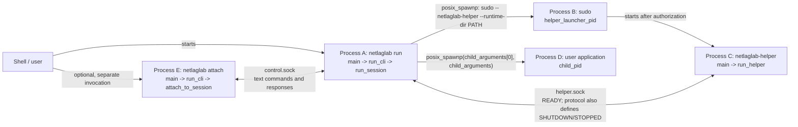
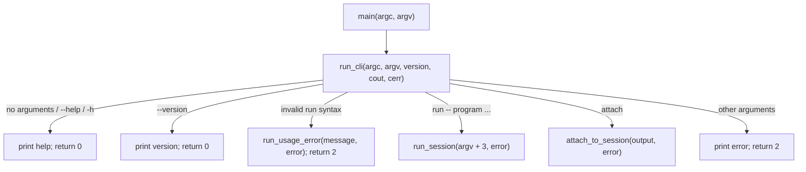
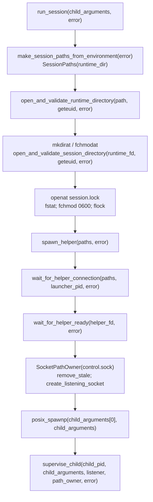
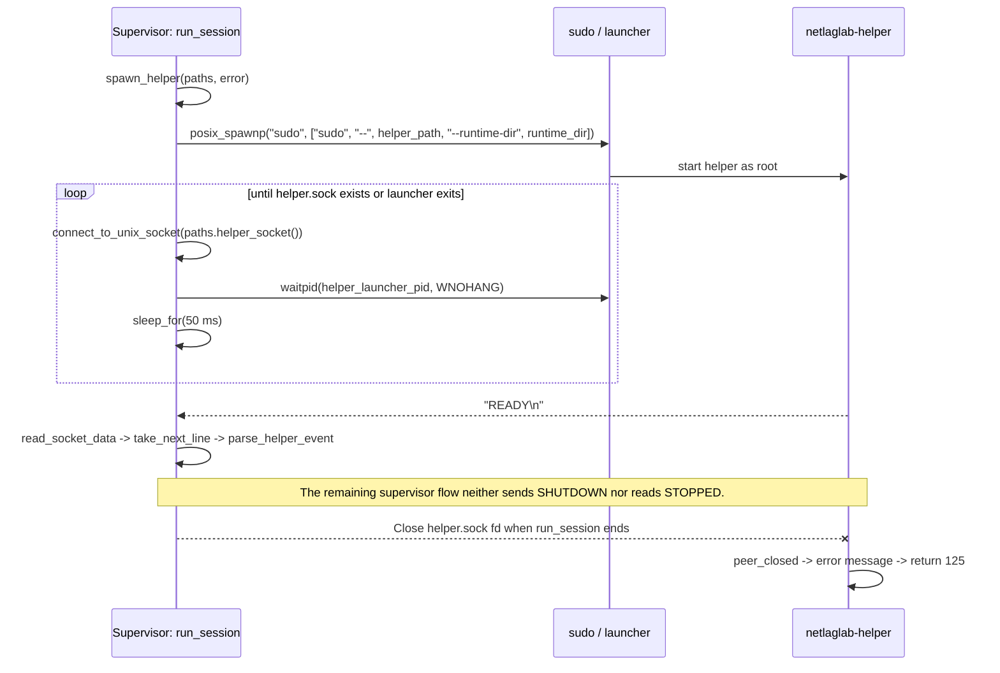
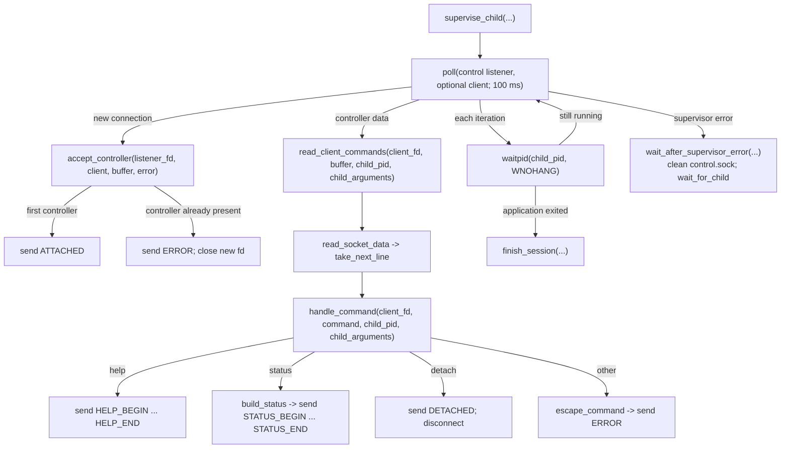
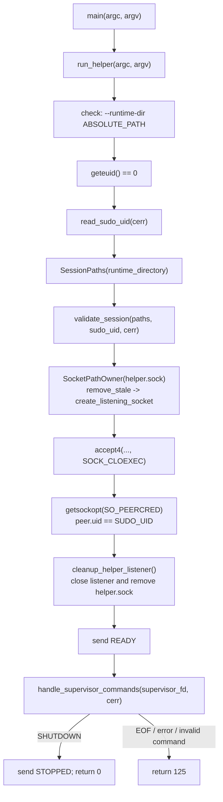
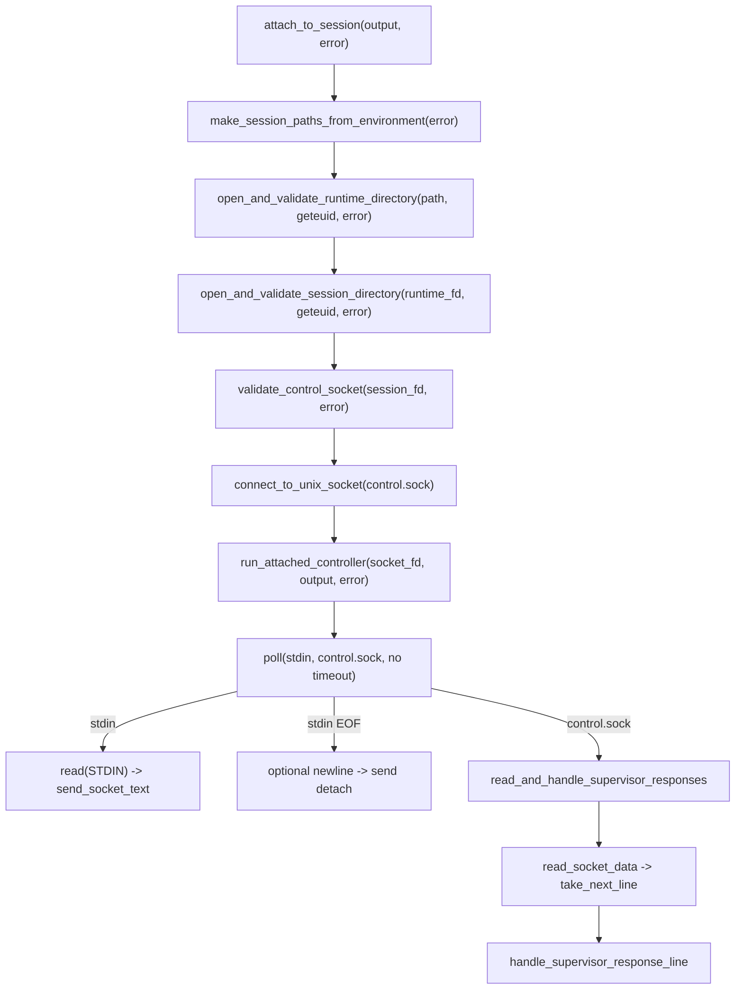

# Current function and process call map

This document describes the working tree as of 2026-09-21, including
uncommitted changes. The production files under `src/` and `include/`, together
with `CMakeLists.txt`, are the source of truth. Planned behavior described in
`PROJECT.md` is not treated as implemented behavior.

The document covers:

- every function and method in the production code;
- both executables: `netlaglab` and `netlaglab-helper`;
- processes created through `posix_spawnp()`;
- communication through `control.sock` and `helper.sock`;
- function arguments, return values, and important system calls;
- automatic RAII cleanup;
- the `NetworkProfile` test flow, kept separate from runtime execution.

Standard-library, GoogleTest, `sudo`, and Linux-kernel internals are not
expanded. Their functions are shown where they form a process, IPC,
filesystem, or resource-lifetime boundary.

## 1. How to read the map

- **Supervisor** — the `netlaglab run -- ...` process that owns the session.
- **Controller** — a separate `netlaglab attach` process.
- **Helper launcher** — the process started as `sudo`. The PID returned by
  `posix_spawnp()` is stored in `helper_launcher_pid`.
- **Helper** — `netlaglab-helper`, running with effective UID `0`.
- **Application** — the program passed after `netlaglab run --`.
- `fd` — a file or socket descriptor. Most descriptor ownership is wrapped in
  `FileDescriptor`.
- In a function parameter, `char* const child_arguments[]` is adjusted by C++
  to `char* const*`: a `nullptr`-terminated program argument vector.
- `std::ostream& output/error` is a non-owning stream reference, usually bound
  to `std::cout` or `std::cerr`.

A solid arrow in a diagram means a direct call or process creation. An arrow
labelled with a socket name represents an exchange of text messages.

## 2. Targets and code assignment

| Target | Kind | Sources | Relationship |
|---|---|---|---|
| `netlaglab_core` | library | `src/network_profile.cpp` | Exposes `validate(NetworkProfile)`; linked by the CLI and tests. |
| `netlaglab` | executable | `attach_client.cpp`, `helper_process.cpp`, `helper_protocol.cpp`, `main.cpp`, `session.cpp`, `session_paths.cpp`, `socket_io.cpp`, `session_socket.cpp`, `session_validation.cpp` | Main CLI, supervisor, and controller. |
| `netlaglab-helper` | executable | `helper_protocol.cpp`, `helper_main.cpp`, `session_socket.cpp`, `session_validation.cpp`, `socket_io.cpp` | Privileged `helper.sock` server. It does not link `netlaglab_core`. |
| `netlaglab_core_tests` | test executable | `tests/network_profile_test.cpp` | Links `netlaglab_core` and `GTest::gtest_main`. |

## 3. Process map



The code does not determine whether a particular `sudo` implementation uses
`exec` for the helper or remains as an intermediary process. What is certain is
that the supervisor starts `sudo` and stores the PID returned by
`posix_spawnp()`.

### 3.1. PID and resource ownership

| Owner | Resource | Creation | Termination in the current code |
|---|---|---|---|
| Supervisor | `helper_launcher_pid` | `spawn_helper()` → `posix_spawnp("sudo", ...)` | `wait_for_helper_connection()` calls `waitpid(..., WNOHANG)` only while waiting for the socket. After connection, the PID is neither monitored nor explicitly reaped. |
| Supervisor | `helper.sock` client connection | `wait_for_helper_connection()` | `FileDescriptor` closes the fd when `run_session()` exits. The supervisor does not send `SHUTDOWN` first. |
| Supervisor | application `child_pid` | `run_session()` → `posix_spawnp()` | `supervise_child()` calls `waitpid(..., WNOHANG)`; the poll-error path uses blocking `wait_for_child()`. |
| Supervisor | `session.lock` | `openat()` + `flock(LOCK_EX | LOCK_NB)` | `FileDescriptor` closes the fd when `run_session()` exits, releasing the flock. |
| Supervisor | `control.sock` listener and path | `SocketPathOwner::create_listening_socket()` | Explicitly cleaned in `finish_session()` or an error path; the destructor is an RAII fallback. |
| Helper | `helper.sock` listener and path | `SocketPathOwner::create_listening_socket()` | Closed and removed immediately after one supervisor has been accepted and authenticated. |
| Helper | supervisor connection | `accept4()` | `FileDescriptor` closes the fd when `run_helper()` exits. |
| Controller | `control.sock` client connection | `connect_to_unix_socket()` | The `FileDescriptor` inside `UnixSocketConnectResult` closes the fd when `attach_to_session()` exits. |

All internal descriptors are created with `O_CLOEXEC` or `SOCK_CLOEXEC`. The
application inherits the environment and standard streams, but should not
inherit session descriptors.

### 3.2. IPC endpoint authentication

| Channel | Server-side check | Client-side check |
|---|---|---|
| `helper.sock` | The helper reads `SO_PEERCRED` and requires `peer_credentials.uid == SUDO_UID`; PID and GID fields are not used. | The supervisor connects to the path and requires a valid `READY`, but does not read the helper's `SO_PEERCRED`. |
| `control.sock` | The supervisor restricts the socket to mode `0600`, but does not read `SO_PEERCRED` after `accept4()`. | Before `connect()`, the controller checks the path's type, UID, and mode; it does not read the supervisor's `SO_PEERCRED` after connecting. |

The user application has no dedicated channel to the helper or controller.

## 4. Main `netlaglab` entry point



### Functions in `src/main.cpp`

| Function | Arguments | Caller | Further calls and result |
|---|---|---|---|
| `int main(int argc, char* argv[])` | `argc`: CLI element count; `argv`: `nullptr`-terminated string array. | Process runtime. | Calls `run_cli(argc, argv, NETLAGLAB_VERSION, std::cout, std::cerr)` and returns its exact result. |
| `int run_cli(int argc, char* argv[], std::string_view version, std::ostream& output, std::ostream& error)` | CLI arguments; CMake version; normal-output and error streams. | `main()` in `netlaglab`. | Recognizes `run`, `attach`, help, and version. Calls `run_usage_error()`, `run_session(argv + 3, error)`, or `attach_to_session(output, error)`. |
| `int run_usage_error(std::string_view message, std::ostream& error)` | Error text without a prefix; error stream. | Three invalid `run` branches in `run_cli()`. | Prints the error and usage; returns `2`. |

`run_cli()` and `run_usage_error()` are in an anonymous namespace and are
private to `main.cpp`.

## 5. `netlaglab run` flow

### 5.1. Main sequence



`run_session()` does not hand the application to the helper or run it inside a
network namespace. The application is currently a direct child of the
supervisor, and status always contains `shaping: not applied`.

### 5.2. Helper startup and handshake



Neither `wait_for_helper_connection()` nor `wait_for_helper_ready()` has a
timeout or retry limit. Waiting can therefore continue indefinitely if the
process remains alive but never completes the handshake.

### 5.3. Supervisor loop and controller



### Functions in `src/session.cpp`

| Function | Arguments | Caller | Further calls and result |
|---|---|---|---|
| `int run_session(char* const child_arguments[], std::ostream& error)` | `child_arguments`: program at `[0]`, following arguments, final `nullptr`; diagnostics stream. | `run_cli()` for `run -- ...`. | Builds and validates directories, locks the session, starts the helper, waits for `READY`, creates `control.sock`, starts the application, and calls `supervise_child()`. Returns the application result or an infrastructure code. |
| `int spawn_error_exit_code(int error_code)` | Error code returned directly by `posix_spawnp()`. | `run_session()` after application startup failure. | Maps `ENOENT → 127`, `EACCES/ENOEXEC → 126`, and everything else → `125`. |
| `int child_exit_code(int status, std::ostream& error)` | Raw `waitpid()` status; diagnostics stream. | `wait_for_child()` and `finish_session()`. | Returns the exit code or `128 + signal`; an unsupported status gives `125`. |
| `int wait_for_child(pid_t child_pid, std::ostream& error)` | Application PID; diagnostics. | `wait_after_supervisor_error()`. | Blocking `waitpid(child_pid, ..., 0)` with `EINTR` retry, followed by `child_exit_code()`. |
| `bool append_escaped_limited(std::string& output, std::string_view input, std::size_t limit)` | Output buffer; input text; maximum total `output` size. | `escape_command()` and `build_status()`. | Escapes backslash, tab, LF, CR, and control bytes as `\xHH`. Returns `false` before exceeding the limit. |
| Local lambda `append_piece(std::string_view piece)` | Piece to append; captures `output` by reference and `limit` by value. | Only `append_escaped_limited()`. | Checks remaining capacity and appends the piece. |
| `std::string escape_command(std::string_view command)` | Unknown controller command. | `handle_command()` for an unknown command. | Calls `append_escaped_limited(..., maximum_command_size * 4)` and returns safe error-response text. |
| `void append_direction_status(std::ostringstream& output, std::string_view name, const DirectionSettings& settings)` | Status stream; `outbound`/`inbound` name; direction settings. | Twice from `build_status()`. | Appends delay, jitter, packet loss, and bandwidth. |
| `std::string build_status(pid_t child_pid, char* const child_arguments[])` | Application PID and argv. | `handle_command()` for `status`. | Creates a block limited to 8 KiB from `STATUS_BEGIN` through `STATUS_END`; calls `append_direction_status()` and `append_escaped_limited()`. The profile is default-constructed and shaping is marked inactive. |
| `CommandResult handle_command(int client_descriptor, std::string_view command, pid_t child_pid, char* const child_arguments[])` | Controller fd; one line without LF; application PID and argv for status. | `read_client_commands()`. | Handles `help`, `status`, `detach`, or an error. Uses `send_socket_text()`, `build_status()`, and `escape_command()`. Returns `keep_connected` or `disconnect`. |
| `bool read_client_commands(int client_descriptor, std::string& command_buffer, pid_t child_pid, char* const child_arguments[])` | Controller fd; persistent partial-line buffer; application PID and argv. | `supervise_child()` after `POLLIN`. | `read_socket_data()` → repeated `take_next_line()` → `handle_command()`. One command/buffer is limited to 1024 B. `false` means disconnect the client. |
| `bool accept_controller(int listening_descriptor, std::optional<FileDescriptor>& client, std::string& command_buffer, std::ostream& error)` | Listener fd; optional current client; command buffer; diagnostics. | `supervise_child()` after listener `POLLIN`. | Calls `accept4(..., SOCK_CLOEXEC)`. Accepts one controller and sends `ATTACHED`; sends an error to a second controller and closes its fd. |
| `void print_terminal_summary(int child_status, std::ostream& error)` | Application `waitpid()` status; stderr. | `finish_session()`. | If stderr is a TTY, prints the exit code or terminating signal. |
| `int finish_session(int child_status, FileDescriptor& listening_socket, SocketPathOwner& socket_path_owner, std::optional<FileDescriptor>& client, std::ostream& error)` | Application status; listener/path owners; optional controller; diagnostics. | `supervise_child()` after application exit. | Calls `child_exit_code()`, closes the listener, removes `control.sock`, sends `SESSION_ENDED` or `SESSION_FAILED`, and calls `print_terminal_summary()`. |
| `void close_control_channel_after_supervisor_error(FileDescriptor& listening_socket, SocketPathOwner& socket_path_owner, std::optional<FileDescriptor>& client, std::ostream& error)` | Control-channel resources and diagnostics. | `wait_after_supervisor_error()` and one `waitpid()` error branch in `supervise_child()`. | Closes the listener, removes `control.sock`, sends `SESSION_FAILED`, and closes the client. |
| `int wait_after_supervisor_error(pid_t child_pid, FileDescriptor& listening_socket, SocketPathOwner& socket_path_owner, std::optional<FileDescriptor>& client, std::ostream& error)` | Application PID and control-channel resources. | `supervise_child()` after `poll()`, listener, or `accept4()` failure. | Calls `close_control_channel_after_supervisor_error()`, then blocking `wait_for_child()`; returns `125` regardless of the child result. |
| `int supervise_child(pid_t child_pid, char* const child_arguments[], FileDescriptor& listening_socket, SocketPathOwner& socket_path_owner, std::ostream& error)` | Application PID/argv; listener resources; diagnostics. | `run_session()` after successful `posix_spawnp()`. | Runs the `poll()`/`accept_controller()`/`read_client_commands()` and `waitpid(WNOHANG)` loop. Exits through `finish_session()` or an error path. |

All functions above except `run_session()` are private to `session.cpp`.

## 6. Starting the helper from the supervisor

### Functions in `src/helper_process.cpp`

| Function | Arguments | Caller | Further calls and result |
|---|---|---|---|
| `std::optional<std::string> resolve_helper_executable_path(std::ostream& error)` | Diagnostics stream. | `spawn_helper()`. | Calls `readlink("/proc/self/exe", ...)`, takes the supervisor directory, and appends `netlaglab-helper`. Returns a full path or `nullopt`. |
| `std::optional<pid_t> spawn_helper(const SessionPaths& paths, std::ostream& error)` | Calculated session paths; diagnostics. | `run_session()`. | Builds argv `sudo -- HELPER --runtime-dir XDG_RUNTIME_DIR`, calls `posix_spawnp()` with the current `environ`, and returns the launcher PID or `nullopt`. |
| `std::optional<FileDescriptor> wait_for_helper_connection(const SessionPaths& paths, pid_t helper_launcher_pid, std::ostream& error)` | `helper.sock` path; launcher PID; diagnostics. | `run_session()`. | Calls `connect_to_unix_socket()`. For `ENOENT`/`ECONNREFUSED`, checks `waitpid(pid, WNOHANG)` and sleeps for 50 ms. Returns a connected fd or `nullopt`. |
| `void report_helper_exit_before_connection(int status, std::ostream& error)` | Status obtained from `waitpid()`; diagnostics. | `wait_for_helper_connection()` after launcher exit. | Distinguishes normal exit, signal termination, and an unsupported status. |
| `bool wait_for_helper_ready(int helper_socket_descriptor, std::ostream& error)` | Connected `helper.sock` fd; diagnostics. | `run_session()`. | `read_socket_data()` → `take_next_line()` → `parse_helper_event()`. Accepts only `READY`; message limit is 1024 B. |

`resolve_helper_executable_path()` and
`report_helper_exit_before_connection()` are private to the file.

## 7. `netlaglab-helper` entry point and flow



### Functions in `src/helper_main.cpp`

| Function | Arguments | Caller | Further calls and result |
|---|---|---|---|
| `int main(int argc, char* argv[])` | Helper process arguments. | Helper process runtime. | Calls `run_helper(argc, argv)` and returns its result. |
| `int run_helper(int argc, char* argv[])` | Expects exactly `--runtime-dir <absolute-path>`. | Helper `main()`. | Validates CLI/root/SUDO_UID/session; creates and removes the `helper.sock` listener; accepts and authenticates the supervisor; sends `READY`; calls `handle_supervisor_commands()`. |
| `int usage_error(std::string_view message)` | Usage-error text. | `run_helper()` for invalid argc/option/path. | Writes to `std::cerr`; returns `2`. |
| `std::optional<uid_t> read_sudo_uid(std::ostream& error)` | Diagnostics. | `run_helper()`. | Reads `SUDO_UID` through `getenv()` and parses the entire field with `std::from_chars()`; returns the UID or `nullopt`. |
| `std::optional<FileDescriptor> validate_session(const SessionPaths& paths, uid_t expected_owner, std::ostream& error)` | Session paths; user UID from `SUDO_UID`; diagnostics. | `run_helper()`. | Opens and validates runtime/session directories, opens `session.lock`, checks type/owner/mode, and uses a failed `flock(LOCK_EX | LOCK_NB)` to confirm that the supervisor holds the lock. Returns the session-directory fd. |
| `bool cleanup_helper_listener(FileDescriptor& listening_socket, SocketPathOwner& socket_path_owner, std::ostream& error)` | Listener; `helper.sock` path owner; diagnostics. | `run_helper()` after `accept4()` and on its error paths. | Calls `listening_socket.reset()` and `socket_path_owner.remove_owned()`. |
| `bool send_helper_error(int supervisor_descriptor, std::string_view message)` | Supervisor fd; text without a prefix. | `handle_supervisor_commands()` for an invalid or oversized command. | Builds `ERROR <message>\n` and calls `send_socket_text()`. |
| `int handle_supervisor_commands(int supervisor_descriptor, std::ostream& error)` | Connected supervisor fd; diagnostics. | `run_helper()` after sending `READY`. | `read_socket_data()` → `take_next_line()` → `parse_helper_command()`. `SHUTDOWN` sends `STOPPED` and returns `0`; EOF/read/protocol failure returns `125`. |

All helper-main functions except shared functions in namespace `netlaglab` are
private to `helper_main.cpp`.

## 8. `netlaglab attach` flow



### Functions in `src/attach_client.cpp`

| Function | Arguments | Caller | Further calls and result |
|---|---|---|---|
| `int attach_to_session(std::ostream& output, std::ostream& error)` | Controller stdout and stderr. | `run_cli()` for `attach`. | Builds paths, validates directories and `control.sock`, connects through `connect_to_unix_socket()`, then calls `run_attached_controller()`. |
| `bool validate_control_socket(int session_directory_descriptor, std::ostream& error)` | Session-directory fd; diagnostics. | `attach_to_session()`. | Calls `fstatat(..., AT_SYMLINK_NOFOLLOW)`; requires a socket owned by `geteuid()` with mode `0600`. |
| `int run_attached_controller(int socket_descriptor, std::ostream& output, std::ostream& error)` | Connected `control.sock` fd; stdout/stderr. | `attach_to_session()`. | Runs a `poll()` loop over stdin and the socket. Forwards raw stdin through `send_socket_text()`; stdin EOF completes a partial line and sends `detach\n`; responses go to `read_and_handle_supervisor_responses()`. |
| `std::optional<int> read_and_handle_supervisor_responses(int socket_descriptor, std::string& response_buffer, ResponseBlock& response_block, std::ostream& output, std::ostream& error)` | fd; persistent partial-line buffer; current `none/help/status` block; stdout/stderr. | `run_attached_controller()` after `POLLIN`/`POLLHUP`. | `read_socket_data()` → repeated `take_next_line()` → `handle_supervisor_response_line()`. The buffer limit is 8 KiB. `nullopt` means continue; `0/1` means exit. |
| `std::optional<int> handle_supervisor_response_line(std::string_view line, ResponseBlock& response_block, std::ostream& output, std::ostream& error)` | One line without LF; block state; stdout/stderr. | `read_and_handle_supervisor_responses()`. | Interprets `ATTACHED`, help/status blocks, `DETACHED`, `SESSION_ENDED`, `SESSION_FAILED`, and `ERROR ...`; returns an optional exit code. |

The controller connection is a separate `netlaglab` invocation; it is not
created by the supervisor.

## 9. Shared path and validation functions

### `SessionPaths` — `src/session_paths.hpp/.cpp`

| Function or method | Arguments | Caller | Result / further calls |
|---|---|---|---|
| `SessionPaths::SessionPaths(std::string xdg_runtime_directory)` | Copied/moved absolute runtime directory. | `make_session_paths_from_environment()` and directly by `run_helper()`. | Calls `join()` four times and stores the session directory, lock, `control.sock`, and `helper.sock` paths. |
| `static std::string SessionPaths::join(std::string_view parent, std::string_view child)` | Parent component and child name. | `SessionPaths` constructor. | Joins them with exactly one `/`. |
| `const std::string& xdg_runtime_directory() const noexcept` | None. | Supervisor, helper, and `spawn_helper()`. | Returns a reference to the base path. |
| `const std::string& session_directory() const noexcept` | None. | No current callers. | Returns a reference to the full session-directory path. |
| `const std::string& lock_file() const noexcept` | None. | No current callers. | Returns a reference to the full lock-file path. |
| `const std::string& control_socket() const noexcept` | None. | `run_session()` and `attach_to_session()`. | Returns a reference to the full `control.sock` path. |
| `const std::string& helper_socket() const noexcept` | None. | `wait_for_helper_connection()` and `run_helper()`. | Returns a reference to the full `helper.sock` path. |
| `std::optional<SessionPaths> make_session_paths_from_environment(std::ostream& error)` | Diagnostics. | `run_session()` and `attach_to_session()`. | Reads `XDG_RUNTIME_DIR`, requires a non-empty absolute path, then constructs `SessionPaths` or returns `nullopt`. |

Calculated paths:

```text
XDG_RUNTIME_DIR
└── netlaglab/                 mode required by validation: 0700
    ├── session.lock           regular file, 0600, supervisor flock
    ├── control.sock           Unix stream socket, 0600, user-owned
    └── helper.sock            Unix stream socket, 0600, chowned to the user after bind
```

### Directory validation — `src/session_validation.cpp`

| Function | Arguments | Caller | Result / further calls |
|---|---|---|---|
| `bool validate_runtime_directory(int descriptor, uid_t expected_owner, std::ostream& error)` | `XDG_RUNTIME_DIR` fd; expected UID; diagnostics. | `open_and_validate_runtime_directory()`. | `fstat()`: requires a directory with the expected UID and no group/other permissions. |
| `bool validate_session_directory(int descriptor, uid_t expected_owner, std::ostream& error)` | `$XDG_RUNTIME_DIR/netlaglab` fd; UID; diagnostics. | `open_and_validate_session_directory()`. | `fstat()`: requires a directory with the expected owner and exactly mode `0700`. |
| `std::optional<FileDescriptor> open_and_validate_runtime_directory(const std::string& path, uid_t expected_owner, std::ostream& error)` | Path; UID; diagnostics. | Supervisor, controller, and helper `validate_session()`. | `open(O_DIRECTORY | O_CLOEXEC | O_NOFOLLOW)` → `validate_runtime_directory()`; returns an fd or `nullopt`. |
| `std::optional<FileDescriptor> open_and_validate_session_directory(int runtime_directory_descriptor, uid_t expected_owner, std::ostream& error)` | Runtime-directory fd; UID; diagnostics. | Supervisor, controller, and helper `validate_session()`. | `openat(runtime_fd, "netlaglab", O_DIRECTORY | O_CLOEXEC | O_NOFOLLOW)` → `validate_session_directory()`. |

## 10. Shared sockets and text I/O

### `SocketPathOwner` — `src/session_socket.hpp/.cpp`

| Function or method | Arguments | Caller | Result / further calls |
|---|---|---|---|
| `SocketPathOwner::SocketPathOwner(int session_directory_descriptor, std::string_view socket_name, const std::string& socket_path, uid_t owner_uid)` | Directory fd; basename; full path; target UID. | `run_session()` for `control.sock`, `run_helper()` for `helper.sock`. | Stores the non-owning directory fd and copies the name/path; initially `owned_ == false`. |
| `SocketPathOwner::~SocketPathOwner()` | None. | Automatically at scope exit. | Calls `remove_owned()` as idempotent cleanup. |
| `SocketPathOwner(const SocketPathOwner&) = delete` | Object that would be copied. | None — invocation is forbidden. | Prevents two objects from believing they own the same path. |
| `SocketPathOwner& operator=(const SocketPathOwner&) = delete` | Object that would be copied. | None — invocation is forbidden. | Copy assignment is disabled for the same ownership reason. |
| `bool remove_stale(std::ostream& error) const` | Diagnostics. | `run_session()` and `run_helper()` before bind. | Calls `fstatat(AT_SYMLINK_NOFOLLOW)`; removes only a socket owned by the target UID or current eUID. |
| `int create_listening_socket(std::ostream& error)` | Diagnostics. | `run_session()` and `run_helper()`. | `socket()` → `umask(0177)` → `bind()` → optional `fchownat()` → `listen(backlog=1)`. Sets `owned_`; returns a raw fd or `-1`. |
| `int remove_owned()` | None. | Destructor and explicit cleanup paths. | If `owned_`, calls `unlinkat()`. Returns `0` or an `errno` value; treats `ENOENT` as success. |

The supplied `session_directory_descriptor` is not owned by
`SocketPathOwner`. Its `FileDescriptor` must outlive the path owner. The
current local-variable lifetimes satisfy this requirement.

### Functions in `src/socket_io.cpp`

| Function | Arguments | Caller | Result / further calls |
|---|---|---|---|
| `UnixSocketConnectResult connect_to_unix_socket(std::string_view socket_path)` | Full Unix-socket path. | Supervisor for `helper.sock`, controller for `control.sock`. | Checks `sockaddr_un::sun_path`, creates `socket(AF_UNIX, SOCK_STREAM | SOCK_CLOEXEC)`, and calls `connect()`. Returns an fd and classified failure information. |
| `bool send_socket_text(int socket_descriptor, std::string_view message)` | Destination fd; complete text to send. | Supervisor, controller, and helper. | Loops over `send(..., MSG_NOSIGNAL)` until all bytes are sent; retries `EINTR`; returns success. |
| `SocketReadResult read_socket_data(int socket_descriptor, std::string& buffer)` | Source fd; persistent destination buffer. | Supervisor, controller, and helper. | Calls `read()` for up to 4096 B with `EINTR` retry; distinguishes data, EOF, and an error with `errno`. |
| `std::optional<std::string> take_next_line(std::string& buffer)` | Buffer containing zero or more lines or a partial line. | Control-command, control-response, and helper-protocol parsers. | Removes and returns text before the first LF, including removal of the LF; returns `nullopt` without a complete line. |

### Helper protocol — `src/helper_protocol.cpp`

| Function | Arguments | Caller | Result |
|---|---|---|---|
| `std::optional<HelperCommand> parse_helper_command(std::string_view line)` | LF-free line from the supervisor. | `handle_supervisor_commands()`. | Only `SHUTDOWN` → `HelperCommand::shutdown`; otherwise `nullopt`. |
| `std::optional<HelperEvent> parse_helper_event(std::string_view line)` | LF-free line from the helper. | `wait_for_helper_ready()`. | Recognizes `READY` and `STOPPED`; otherwise `nullopt`. The current caller accepts only `READY`. |
| `std::string_view helper_command_message(HelperCommand command)` | Enum value, currently only `shutdown`. | No callers in the current code. | `shutdown` → `"SHUTDOWN\n"`. |
| `std::string_view helper_event_message(HelperEvent event)` | `ready` or `stopped`. | `run_helper()` and `handle_supervisor_commands()`. | Returns `"READY\n"` or `"STOPPED\n"`. |

Complete defined protocol:

| Direction | Message | Current sender | Current receiver |
|---|---|---|---|
| Helper → supervisor | `READY\n` | `run_helper()` | Handled by `wait_for_helper_ready()`. |
| Supervisor → helper | `SHUTDOWN\n` | No call to `helper_command_message()` and no send operation. | `handle_supervisor_commands()` can handle it. |
| Helper → supervisor | `STOPPED\n` | The helper would send it after `SHUTDOWN`. | `parse_helper_event()` recognizes it, but the supervisor stops reading helper events after `READY`. |
| Helper → supervisor | `ERROR <text>\n` | `send_helper_error()` for an invalid command. | No general supervisor receive loop exists after `READY`. |

## 11. RAII classes and automatic calls

### `FileDescriptor` — `src/file_descriptor.hpp`

| Method | Arguments | Invocation / effect |
|---|---|---|
| `explicit FileDescriptor(int descriptor) noexcept` | Raw fd whose ownership is transferred. | Called when wrapping an `open*`, `socket`, `accept4`, or listener result. |
| `~FileDescriptor()` | None. | Automatically calls `reset()`, which calls `close()` for an fd other than `-1`. |
| `FileDescriptor(const FileDescriptor&) = delete` | Object that would be copied. | Copying is forbidden so two owners cannot hold one fd. |
| `FileDescriptor& operator=(const FileDescriptor&) = delete` | Object that would be copied. | Copy assignment is forbidden. |
| `FileDescriptor(FileDescriptor&& other) noexcept` | Other rvalue owner. | Calls `other.release()` and takes the fd. Used, among other places, when returning through `optional`. |
| `FileDescriptor& operator=(FileDescriptor&& other) noexcept` | Other rvalue owner. | Calls `reset()` on the current fd, then `other.release()`. |
| `int get() const noexcept` | None. | Returns the fd without transferring ownership; used before system calls. |
| `void reset() noexcept` | None. | Calls `close(descriptor_)` and stores `-1`; idempotent. |
| `int release() noexcept` | None. | Returns the raw fd and stores `-1`; used by `create_listening_socket()`. |

The automatic destruction order after a typical `run_session()` is the reverse
of local-object construction. After `supervise_child()` returns, this includes
the `control.sock` listener/path owner, the `helper.sock` connection, the lock,
and the directory descriptors. Closing `helper.sock` is currently the only end
signal observed by the helper, but the helper classifies that EOF as an error,
not as a clean shutdown.

## 12. `NetworkProfile` model and tests

### Production functions

| Function | Arguments | Caller | Result / further calls |
|---|---|---|---|
| `std::vector<ValidationError> validate(const NetworkProfile& profile)` | Profile with separate `outbound` and `inbound` settings. | Eight unit tests; no runtime CLI caller. | Creates an error list and calls `validate_direction()` twice. |
| `void validate_direction(const DirectionSettings& settings, TrafficDirection direction, std::vector<ValidationError>& errors)` | One direction's settings; direction label; output error vector. | `validate()`. | Checks negative delay/jitter, finite packet loss in range 0–100, and bandwidth other than zero. |

`build_status()` uses the `NetworkProfile` and `DirectionSettings` types but
does not call `validate()`. It constructs a default profile only to display
unrestricted settings.

### `tests/network_profile_test.cpp` flow

GoogleTest supplies `main()` for the test target. Each of the eight `TEST(...)`
cases constructs a `NetworkProfile` and calls `validate(profile)`. The helper
function is:

| Function / callable | Arguments | Caller | Result |
|---|---|---|---|
| `bool has_error(const std::vector<ValidationError>& errors, TrafficDirection direction, NetworkSetting setting)` | Error list and the requested direction/setting pair. | Tests for rejected values. | Calls `std::any_of()` with a lambda that captures `direction` and `setting`. |
| Lambda `[](const auto& error)` in the final test | One `ValidationError`. | `std::all_of()`. | Checks that `message` is not empty. |

The tests create no processes, directories, or sockets.

## 13. `control.sock` message map

| Direction | Data | Sending function | Receiving function |
|---|---|---|---|
| Controller → supervisor | Arbitrary stdin data; the protocol is line-based. | `run_attached_controller()` | `read_client_commands()` |
| Controller → supervisor | Automatic `detach\n` after stdin EOF. | `run_attached_controller()` | `handle_command()` |
| Supervisor → controller | `ATTACHED\n` | `accept_controller()` | `handle_supervisor_response_line()` |
| Supervisor → controller | `HELP_BEGIN\n...HELP_END\n` | `handle_command()` | Help-block parser. |
| Supervisor → controller | `STATUS_BEGIN\n...STATUS_END\n` | `build_status()` + `handle_command()` | Status-block parser. |
| Supervisor → controller | `DETACHED\n` | `handle_command()` | Ends the controller with code `0`. |
| Supervisor → controller | `ERROR ...\n` | `handle_command()` or `accept_controller()` | Prints the error; controller conflict exits with code `1`. |
| Supervisor → controller | `SESSION_ENDED\n` | `finish_session()` | Prints `Session ended.` and exits with code `0`. |
| Supervisor → controller | `SESSION_FAILED\n` | Error cleanup | Exits with code `1`. |

## 14. Important system calls

| Boundary | Project functions | Effect |
|---|---|---|
| Environment | `make_session_paths_from_environment()`, `read_sudo_uid()` | `getenv("XDG_RUNTIME_DIR")`, `getenv("SUDO_UID")`. |
| Identity | `run_session()`, controller, helper | `geteuid()`; helper requires eUID `0`; helper-side `SO_PEERCRED` compares the peer UID with `SUDO_UID`. The `ucred` PID field is not compared. |
| Helper process | `spawn_helper()` | `posix_spawnp()` starts `sudo` with the current `environ`. |
| Application process | `run_session()` | `posix_spawnp()` starts the program without a shell, using user argv and current `environ`. |
| Waiting | `wait_for_helper_connection()`, `supervise_child()`, `wait_for_child()` | `waitpid()` in non-blocking or blocking mode. |
| Multiplexing | `supervise_child()`, `run_attached_controller()` | `poll()` over sockets and, in the controller, stdin. |
| Directories and lock | Session setup/validation | `open/openat`, `mkdirat`, `fstat/fstatat`, `fchmod/fchmodat`, `flock`. |
| Unix sockets | `SocketPathOwner`, `connect_to_unix_socket()`, acceptors | `socket`, `bind`, `listen`, `connect`, `accept4`, `getsockopt(SO_PEERCRED)`, `unlinkat`. |
| Data transfer | Socket I/O functions and controller | `send(MSG_NOSIGNAL)` and `read()`. |
| Time | `wait_for_helper_connection()` | `sleep_for(50 ms)` between connection attempts. |

## 15. Exit codes

| Process / situation | Code |
|---|---|
| `netlaglab`: successful help/version | `0` |
| `netlaglab`: CLI syntax error | `2` |
| `netlaglab attach`: clean detach or session end | `0` |
| `netlaglab attach`: connection/protocol/session error | `1` |
| `netlaglab run`: application exits normally | Application exit code. |
| `netlaglab run`: application terminates by signal | `128 + signal number`. |
| `netlaglab run`: program not found | `127` |
| `netlaglab run`: permission denied or invalid executable format | `126` |
| `netlaglab run`: other infrastructure failure | Usually `125`. |
| `netlaglab-helper`: usage error | `2` |
| `netlaglab-helper`: eUID is not root | `EXIT_FAILURE`, commonly `1`. |
| `netlaglab-helper`: validation, IPC, or protocol failure | `125` |
| `netlaglab-helper`: successfully handled `SHUTDOWN` | `0` |

## 16. Actual incomplete connections

This is not a list of planned features. It identifies places where one side of
a connection exists in the current call graph without the other side:

1. `helper_command_message(HelperCommand::shutdown)` exists, but no supervisor
   code calls it or sends `SHUTDOWN`.
2. The helper can send `STOPPED`, and `parse_helper_event()` can recognize it,
   but the supervisor has no event-reading loop after receiving `READY`.
3. `helper_launcher_pid` is checked/reaped only before the connection is
   established. After a successful connection, the supervisor neither
   monitors helper death nor performs a final `waitpid()` for that PID.
4. Normal application termination closes the helper connection through the
   `FileDescriptor` destructor. The helper treats EOF before `SHUTDOWN` as an
   error and exits with code `125`.
5. The helper is started and authenticates the supervisor, but performs no
   network operations yet. The application is not placed in a namespace and
   no `tc`/netem configuration is applied.
6. `validate(NetworkProfile)` is connected to tests but not to runtime flow;
   status always displays a default profile.

This is the actual state of the current code, not a proposed target design.
