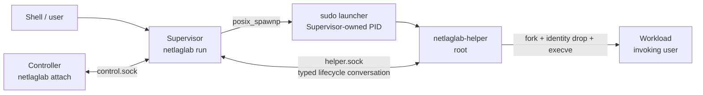

# Current runtime call map

Last verified against the working-tree code: 2026-09-29.

This document maps the implemented process, socket, ownership, and cleanup
flow. It does not treat accepted target architecture as implemented behavior.

## Targets

| Target | Responsibility |
|---|---|
| `netlaglab_core` | `NetworkProfile` validation and atomic typed Profile Change application. |
| `netlaglab` | CLI, user-scoped Supervisor, Controller client, lifecycle coordination, signal self-pipe, and `sudo` launcher ownership. |
| `netlaglab-helper` | Authenticated root helper, host lock, Workload launch/reaping, stop/Profile Change commands, and final helper events. |
| `netlaglab_core_tests` | Network-profile validation tests. |
| `netlaglab_lifecycle_tests` | Scripted tests through the blocking lifecycle seam. |
| `netlaglab_protocol_tests` | Start-block and helper-conversation tests. |
| `netlaglab_controller_protocol_tests` | Controller framing, escaping, and typed-command tests. |
| `netlaglab_controller_outcome_tests` | Structured terminal Session Outcome protocol and attach-presentation tests. |
| `netlaglab_process_tests` | Local unprivileged Workload-launch tests using `netlaglab-workload-probe`. |

## Process and IPC topology



The helper is the Workload's direct parent. The Supervisor never calls
`waitpid()` for the Workload; it learns activation and terminal status through
semantic helper events. The Supervisor owns and always attempts to reap only
the `sudo` launcher PID.

The implemented checkpoint does not create a network or mount namespace.
Consequently the Workload still uses the host network environment even though
its lifecycle owner has moved to the helper.

## `netlaglab run` call sequence

```text
main
  -> run_cli
    -> run_session(child_arguments, error)
      -> capture_workload_context
      -> serialize_start_block
      -> validate XDG_RUNTIME_DIR and netlaglab session directory
      -> open, validate, and flock session.lock
      -> SignalPipe::create
      -> spawn_helper
         -> posix_spawnp("sudo", ["sudo", "--", helper, "--runtime-dir", ...,
            "--supervisor-pid", getpid(), "--supervisor-start-time",
            /proc/self/stat.starttime])
      -> wait_for_helper_connection
         -> connect_to_unix_socket(helper.sock)
         -> validate helper.sock type, owner, and mode
         -> authenticate root peer with SO_PEERCRED and bind its PID to the
            launched sudo process tree
      -> remove stale control.sock; do not publish a new listener yet
      -> ProductionLifecycleAdapter
      -> run_session_lifecycle(adapter)
         -> adapter.begin(): receive READY, transfer standard descriptors,
            send START block
         -> adapter.wait(): poll helper.sock, self-pipe, and active Controller fds
         -> adapter.request_stop(): send STOP TERM or STOP KILL
         -> adapter.reap_launcher(): close helper channel and reap sudo
         -> adapter.finalize(): remove control.sock
         -> append Supervisor cleanup failure when necessary
         -> adapter.publish_outcome(): notify the Controller without changing the outcome
      -> session_presentation maps SessionOutcome to diagnostics and CLI status
```

`control.sock` is created only after the explicit `ACTIVE <pid>` event. Before
that event there is no public active-Session endpoint.

## Helper startup and Workload launch

```text
netlaglab-helper main
  -> run_helper
    -> validate --runtime-dir, Supervisor PID/starttime, eUID 0, SUDO_UID,
       and SUDO_GID
    -> open a pidfd and verify the launching Supervisor's /proc starttime
    -> validate the user runtime directory and held session.lock
    -> create helper.sock and poll it together with the Supervisor pidfd
    -> authenticate the exact Supervisor PID, UID, and GID with SO_PEERCRED
    -> read the authenticated Supervisor's supplementary groups from
       /proc/<peer-pid>/status
    -> acquire /run/netlaglab/host.lock
    -> remove helper.sock listener path
    -> ignore helper-side SIGINT
    -> send READY
    -> receive the standard-descriptor marker and optional SCM_RIGHTS payload
    -> read and validate the bounded START block (30-second deadline begins
       at START_BEGIN)
    -> launch_workload
       -> pipe2(O_CLOEXEC) for exec-success evidence
       -> fork
       -> child: PR_SET_PDEATHSIG(SIGKILL)
       -> child: restore default SIGINT
       -> child: map transferred/inherited/closed stdin, stdout, and stderr
       -> child: setgroups -> setgid -> setuid
       -> child: PR_SET_NO_NEW_PRIVS
       -> child: chdir
       -> child: execve using the transmitted argv, ordered environment,
          and first exact PATH= entry
       -> parent: EOF on the error pipe means exec succeeded
    -> send ACTIVE <pid> or START_FAILED <125|126|127>
    -> supervise_workload
       -> poll helper.sock and waitpid(Workload, WNOHANG)
       -> complete each Profile Change as restored-after-failure until a real shaping adapter exists
       -> apply STOP TERM / STOP KILL to the directly managed PID only
       -> send WORKLOAD_EXITED or WORKLOAD_SIGNALED after reaping
       -> release /run/netlaglab/host.lock
       -> send CLEANUP_OK and exit
```

If the Supervisor connection is lost, the helper sends `SIGTERM` to the
directly managed Workload, waits five seconds, then sends `SIGKILL` if needed,
reaps it, releases the host lock, and exits. `WorkloadProcess` has a destructor
fallback that kills and reaps an otherwise still-owned PID.

## Execution-context transport

The Supervisor captures one immutable `WorkloadContext` containing:

- an absolute current working directory;
- the original, ordered argv including `argv[0]`;
- the complete ordered environment including duplicate entries.

It sends the accepted line-oriented block:

```text
START_BEGIN
CWD <uppercase hex>
ARG <uppercase hex>
ENV <uppercase hex>
START_END
```

The parser rejects malformed or lowercase hex, decoded NUL, invalid phase
ordering, values over 128 KiB, more than 4096 argv or environment entries, and
total decoded storage over 1 MiB including NUL terminators. Before this block,
the Supervisor uses one `SCM_RIGHTS` transfer to preserve every non-terminal
standard descriptor's open-file semantics. Terminal descriptors are inherited
through the sudo topology, and explicitly closed descriptors remain closed.
All NetLagLab internal descriptors are close-on-exec.

## Helper conversation

`SupervisorHelperConversation`, `HelperStartConversation`, and
`HelperRuntimeConversation` own partial buffering, extraction of complete
frames, size limits, and legal ordering for their respective phases.

| Direction | Frame | Meaning |
|---|---|---|
| Helper -> Supervisor | `READY` | Authentication, host lock, and helper preflight succeeded; START may be sent. |
| Helper -> Supervisor | `ACTIVE <pid>` | `execve()` succeeded. The Supervisor may publish `control.sock`. |
| Helper -> Supervisor | `START_FAILED <125|126|127>` | Pre-activation launch failed. |
| Helper -> Supervisor | `WORKLOAD_EXITED <0..255>` | The activated Workload was reaped after normal exit. |
| Helper -> Supervisor | `WORKLOAD_SIGNALED <signal>` | The activated Workload was reaped after a signal. |
| Helper -> Supervisor | `CLEANUP_OK` | All resources owned by this checkpoint were cleaned. |
| Helper -> Supervisor | `CLEANUP_FAILED` | Cleanup or reaping failed. |
| Helper -> Supervisor | `ERROR <safe reason>` | Fatal helper/conversation failure. |
| Helper -> Supervisor | `PROFILE_OK` | The requested Profile Change was applied. |
| Helper -> Supervisor | `PROFILE_FAILED APPLY_FAILED` | Apply failed and the preceding confirmed profile was restored. |
| Helper -> Supervisor | `ERROR PROFILE_STATE_UNKNOWN` | Profile state is unknown; only lifecycle completion remains legal. |
| Supervisor -> Helper | START block | One-time Workload execution context. |
| Supervisor -> Helper | `STOP TERM` | Signal the directly managed Workload with SIGTERM. |
| Supervisor -> Helper | `STOP KILL` | Signal the directly managed Workload with SIGKILL. |
| Supervisor -> Helper | `SHUTDOWN` | Compatibility command; currently treated as a SIGTERM stop request. |
| Supervisor -> Helper | `PROFILE_SET_*` / `PROFILE_RESET` | One normalized, allowlisted typed Profile Change. |

EOF, malformed input, an oversized frame, or impossible ordering becomes a
typed conversation-loss event.

## Supervisor lifecycle seam

`run_session_lifecycle(LifecycleAdapter&)` is the blocking coordination seam.
The production adapter performs real polling, socket I/O, signal integration,
and launcher reaping. Tests supply a scripted adapter at the same seam.

`SessionOutcome` preserves two independent facts:

- optional Workload result: start failure, normal exit, or signal;
- zero or more infrastructure failures: start, conversation, profile state, stop request,
  cleanup, launcher reaping/finalization, or impossible event.

An infrastructure failure maps the CLI result to `125` without discarding an
already known Workload result. Otherwise a start failure returns `126`/`127`,
a normal exit returns its code, and a signal returns `128 + signal`.
That mapping and the per-stage diagnostic text live in the CLI presentation
module rather than in the lifecycle domain types.

The stop state is:

```text
Controller stop -> STOP TERM -> 5 s -> STOP KILL
first terminal SIGINT -> observe only -> 5 s -> STOP TERM -> 5 s -> STOP KILL
second terminal SIGINT -> STOP KILL immediately
```

The non-blocking close-on-exec self-pipe is installed before invoking `sudo`.
The production adapter preserves an absolute deadline across unrelated poll
events instead of restarting a grace period.

## Controller flow

`netlaglab attach` validates and connects to `control.sock`, then polls stdin
and the Supervisor connection. The Supervisor accepts at most one Controller.
`ControllerControlPlane` owns command framing, bounded queueing, response text,
reply ownership, confirmed profile, and public state through one event/action
interface. The pure
`parse_controller_command()` seam validates printable-ASCII/tab input, the
1024-byte raw-line limit, command grammar, units, bounds, and exact integer
normalization. It returns typed commands, an ignored-line marker, or a
structured error; raw Controller text never crosses into the helper. The
production adapter executes typed actions synchronously and feeds write failure
back before executing any later dispatch action.

| Command | Supervisor action |
|---|---|
| `help` | Send the current command list. |
| `status` | Report active helper-owned Workload PID/argv, public state, and the last helper-confirmed profile. |
| `set <direction> <setting> <value>` | Validate, normalize, queue, and dispatch one typed Profile Change; production currently reports restored-after-failure. |
| `reset <direction> <setting>` | Queue and dispatch a typed reset through the same serialized path. |
| `stop` | Send `STOPPING`, generate a typed lifecycle stop request, and keep the Controller attached for the terminal Session message. |
| `detach` | Send `DETACHED` and close only this Controller. |

Controller EOF, detach, protocol failure, or connection loss does not stop the
Session. After helper cleanup, launcher reaping, and Supervisor cleanup, a new
Supervisor serializes the final typed `SessionOutcome` as one bounded block:

```text
SESSION_OUTCOME_BEGIN
WORKLOAD EXIT <0..255> | WORKLOAD SIGNAL <1..127> | WORKLOAD UNKNOWN
INFRASTRUCTURE OK | INFRASTRUCTURE FAILED
FAILURE <allowlisted stage>  # one or more lines only after FAILED
SESSION_OUTCOME_END
```

The shared `controller_session_outcome` boundary owns serialization, incremental
parsing, exact tokens, ranges, duplicate rejection, structural ordering, and
the 1024-byte exchange limit. `INFRASTRUCTURE OK` requires a known Workload
result; `INFRASTRUCTURE FAILED` requires at least one failure. A terminal send
failure is Controller loss and cannot change the already final Session Outcome.
The attach client maps the typed value to its own output and status policy and
continues to accept legacy `SESSION_ENDED`/`SESSION_FAILED` input from an older
Supervisor. New Supervisors do not emit the legacy lines.

## Resource ownership and cleanup

| Owner | Resource | Cleanup |
|---|---|---|
| Supervisor | per-user `session.lock` | fd close releases `flock`. |
| Supervisor | `sudo` launcher PID | 2 s natural wait, SIGTERM, 2 s wait, SIGKILL, final blocking `waitpid`; forced/inconsistent termination is failure. |
| Supervisor | helper client, signal pipe, Controller fds | RAII fd close. |
| Supervisor | `control.sock` path | Removed after launcher reaping; failure changes result to `125`. |
| Helper | `/run/netlaglab/host.lock` | Held from authenticated preflight through cleanup, then released before the final helper result. |
| Helper | `helper.sock` listener/path | Removed immediately after authenticated accept and host-lock acquisition. |
| Helper | directly managed Workload PID | Reaped on natural exit, requested stop, or Supervisor loss. |
| Workload | descendants | Not owned, tracked, signalled, or reaped by NetLagLab. |

## Implemented tests

- lifecycle: clean completion, pre-activation failure, fast exit,
  infrastructure precedence, helper loss, Controller loss, both Ctrl-C paths,
  terminal-event cancellation, and stop-deadline completion;
- conversation: partial and coalesced frames, early EOF, oversize, illegal
  ordering, and allowlisted runtime commands;
- Controller: all command families, typed Profile Changes, whitespace and
  units, numeric bounds and normalization, every structured parser error,
  partial/oversized framing, bounded queueing, reply ownership, confirmed
  status, stopping, disconnect/replacement, action failure, and detach;
- terminal Session Outcome: clean exit/signal, all allowlisted infrastructure
  failures, known/unknown Workload results, fragmentation/coalescing, malformed
  and impossible blocks, bounds, legacy input, attach presentation, cleanup
  ordering, and delivery-failure independence;
- context: byte-preserving round trip, duplicates/order, malformed input,
  invalid ordering, and bounds;
- process: exec-success handshake, first `PATH=`, missing/non-executable
  mapping, argv/environment/cwd preservation, and fast exit;
- network profile: the existing eight validation cases.

## Deliberately incomplete runtime connections

1. No network or mount namespace, veth, routes, DNS view, NAT, firewall
   adapter, qdisc, or live Network Profile mutation is created.
2. The typed Profile Change path is integrated, but the production restore-only
   adapter performs no shaping; status therefore still says `shaping: not applied`.
3. No durable firewall recovery journal exists. Q47 remains open.
4. DNS contents (Q64) and host-route/NAT policy (Q65) remain open, so Internet
   connectivity setup must not be implemented implicitly.
5. The privileged end-to-end happy path and terminal/pipe behavior through the
   actual local `sudo` policy require a separate explicitly authorized check.

See [Session lifecycle implementation status](architecture/session-lifecycle-implementation-status.md)
for the checkpoint handoff and next work.
